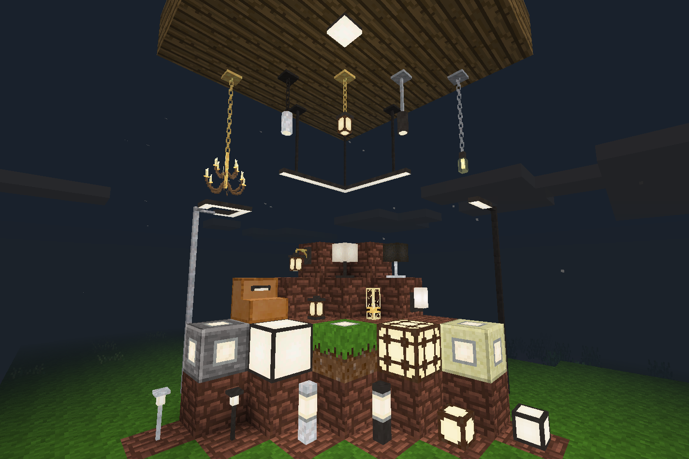

# morelights

Minetest mod adding additional lighting nodes.

The Morelights modpack adds over 30 lighting and accessory nodes to suit
various styles of builds, both interior and exterior. Includes basic light
blocks, modern and historical-style lighting, and customizable street lamps.

The modpack is lightweight, with only about **60 kB** of media, including 3D
models.

Some nodes (ceiling lights, bar lights, poles) can be rotated to serve
different purposes.

Morelights currently supports Minetest Game, MineClone 2, and Hades Revisited.

## Craft Recipes

Craft recipes for all items can be found in [crafts.md](crafts.md).

## Licenses

Source code is licensed under the LGPL v3.0 license. All other media and assets
are licensed under the CC BY-SA 4.0 license.
